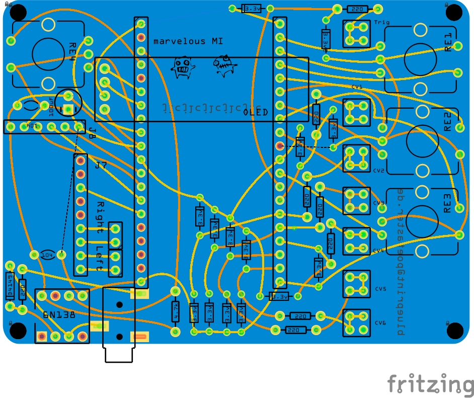
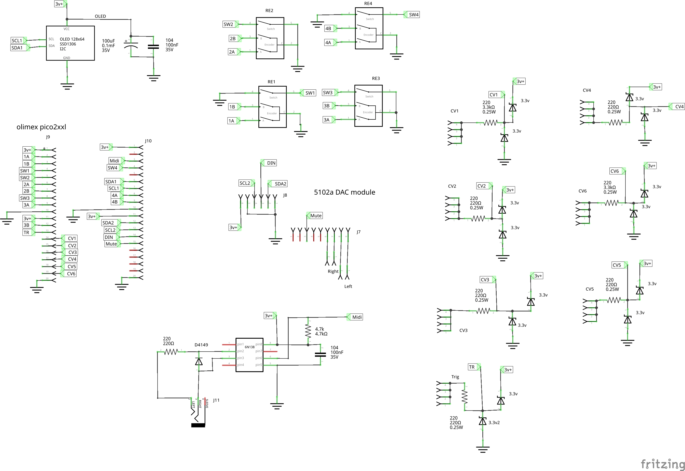

## Introduction

marvelousMI is a fritzing project and PCB gerbers for a small desktop Mutable Instruments synth for use with the arduinoMI libraries. 

https://github.com/poetaster/arduinoMI

This is a basic circuit around an Olimex Pico2-xxl using a pcm5102 DAC for audio.

The firmware directory includes a complete synth with 3 parts:
* MI braids
* MI plaits
* MI rings

It's WIP but fully functional with midi and cv input.

More details and example audio and video can be found on my website at https://poetaster.org/marvelous

. I'm also on etsy at https://tonetoys.etsy.com ....
