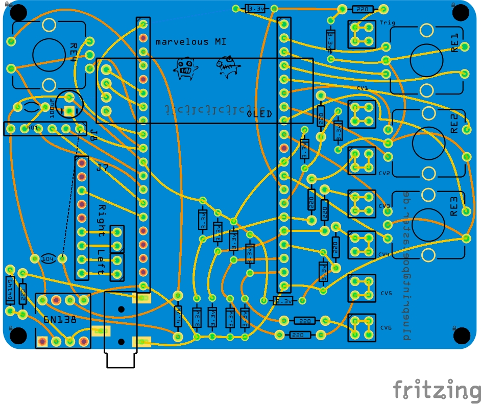
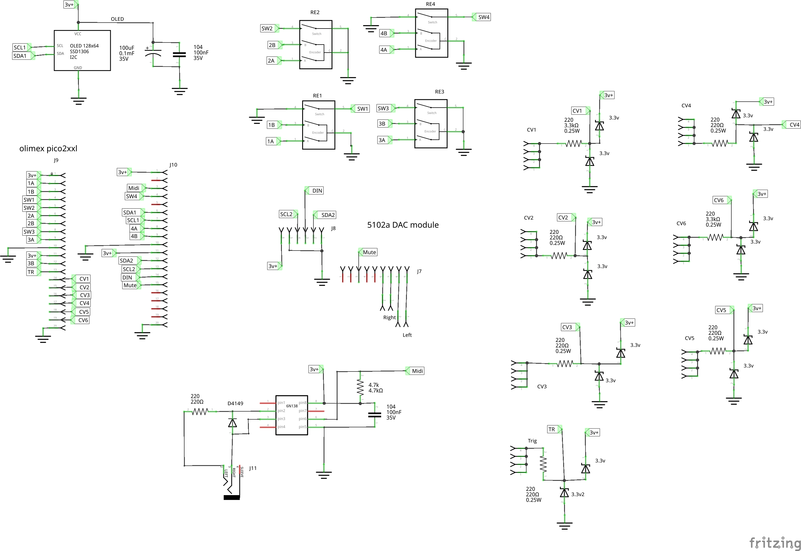

## Introduction

marvelousMI is a fritzing project and PCB gerbers for a small desktop Mutable Instruments synth for use with the arduinoMI libraries. 

https://github.com/poetaster/arduinoMI

This is a basic circuit around an Olimex Pico2-xxl using a pcm5102 DAC for audio.

The firmware directory includes a complete synth with 3 parts:
* MI braids
* MI plaits
* MI rings

It's WIP but fully functional with midi and cv input.

More details and example audio and video can be found on my website at https://poetaster.org/marvelous

## Building with the arduino ide

I'm still using 1.8.19 because the behaviour of includes changed so much that it's easier just to stick to it. Some users have made adjustments to the lib to get them to compile, but the form in the repos is 1.8.19 compatible.

To build the ino you will need:

Into the arduino library context (on linux ~/Arduino/libraries) clone the individual modules:
https://github.com/poetaster/STMLIB
https://github.com/poetaster/PLAITS
https://github.com/poetaster/BRAIDS
https://github.com/poetaster/RINGS

In the STMLIB and PLAITS directories you will need to check out explicit branches:

git checkout plaits1.2 in both those directories.

You also need a couple of other libraries that you can install with the arduino ide:

Bounce2
pio_encoder
RotaryEncoder (I'm working with the raspberry pi guys on it).
Adafruit_SSD1306

with that done you should be able to compile / install directly to a marvelous or your own version thereof.

. I'm also on etsy at https://tonetoys.etsy.com ....

## hardware notes.

Marvelous uses the XSMT pin of the PCM5102a for mute, which means a number od things need to be observed.
1. Do not solder the jumper H3L on the bottom of the board. It's connected. 
2. DO solder the other jumpers, H1,H2,H4 and take them all L (low).

